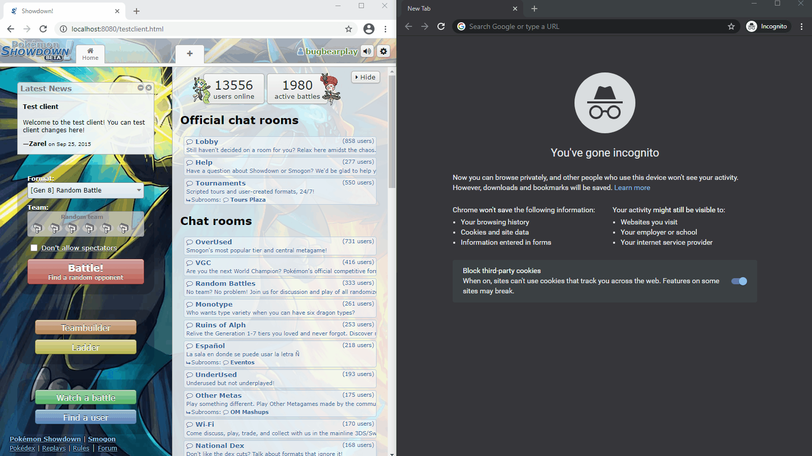

# Proposal - Use PouchDB for Storage

## Demo / POC

[See code changes](https://github.com/aviettran/pokemon-showdown-client/compare/feature/pouchDb)

## Introduction

For web users, `localStorage` is at the mercy of their web browser. Using a library (`PouchDB`) would provide a feature-rich API for more advanced functionality, most important of which would allow users to sync their teams to an external server.

`PouchDB` is an offline-first storage library and NoSQL database. It chooses a storage provider based on browser compatibility (i.e., `IndexDB` -> `WebSQL` -> `localStorage`). The `PouchDB` API would allow the browser to sync data to an external server exclusively via HTTP with client-side JavaScript.

## Goals

- Parity with existing functionality
- Allow users to opt-in to edit their teams, in real-time, from anywhere (any browser, mobile, etc)
- Allow users to opt-in to offload teams to an external server

### Option 1 - Third Party Support

`PouchDB` is `CouchDB` compatible, which means a third party can host a production `CouchDB` against which the PS client can sync teams.

This option suggests that we:

- Allow users to choose their own external `CouchDB` server
- Allow users to supply credentials and store them in the client (not ideal)
- Or allow Showdown to issue JWTs for auth (lower risk)

### Option 2 - PS Hosted CouchDB

- PS to host a production `CouchDB`
- PS login server to issue JWT

## Risks

- Introduction of a new library, PouchDB (124K)
- Storage limitations as a consequence changing formats (currently untested)
- Handling credentials / tokens

## Phases

- Convert `storage.js` to a TypeScript interface and split into different providers (legacy, Node Webkit, PouchDB)
- Archieve feature parity with `PouchDB` as a storage provider
    - Ensure a single team update corresponds to a single DB `put`
    - Write code to migrate formats
- Extend UI code to be fully capable of recieving and reacting to events from PouchDB (changes to external databases)
    - See demo (I have to reload the Teambuilder after an external change)
- Ensure proper conflict resolution (e.g., creating duplicates like Google Drive or OneDrive does)
- Solve for server-side infrastructure (third-party vs PS-hosted)
    - Authentication
    - User management
    - Hosting
- (Optionally) Revisit Node Webkit storage

## Future Improvements

- Allow the user to query their local DB instance (use Mango queries?)

## Files in this folder

`./docker-compose.yml` - to spinup a quick local `CouchDB` for POC purposes

`./10-custom.ini` - config file for `CouchDB` (enable CORS)
